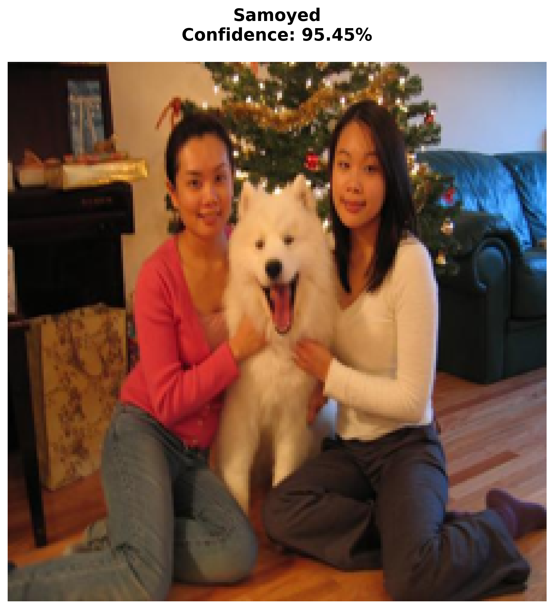
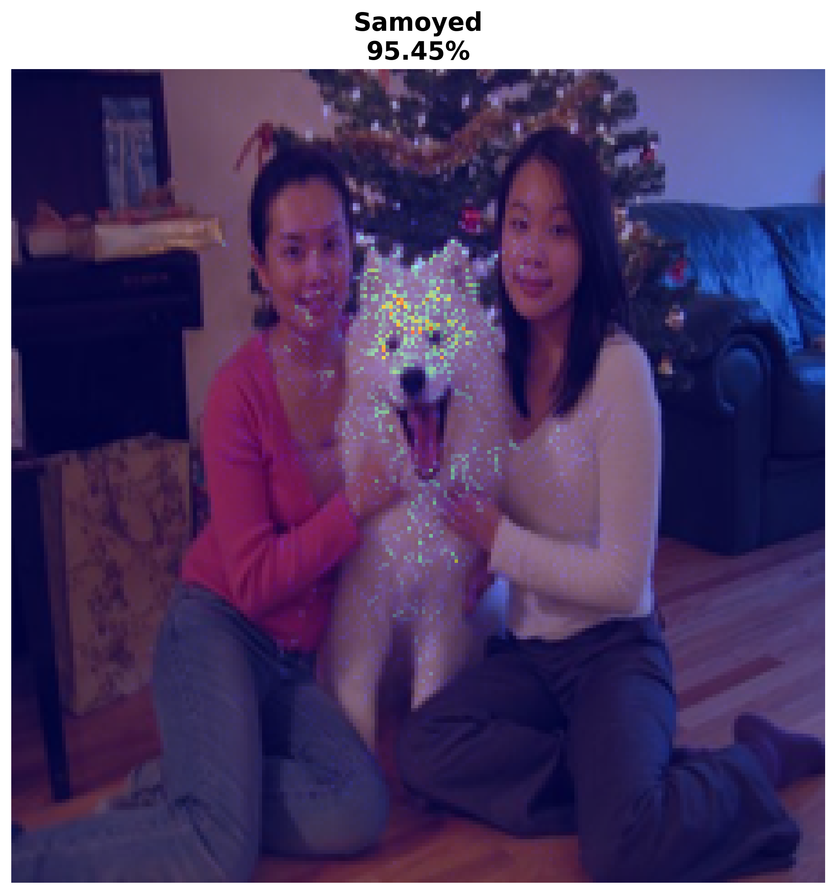
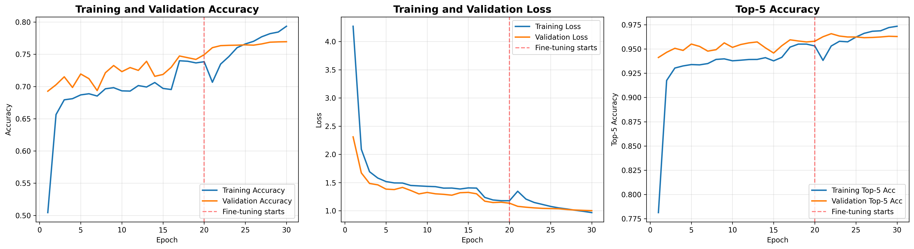
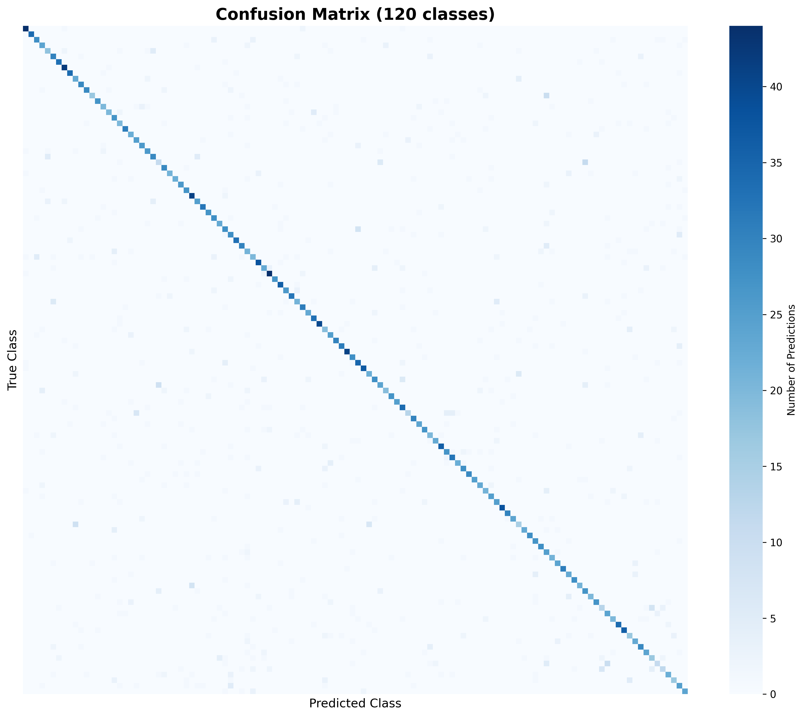
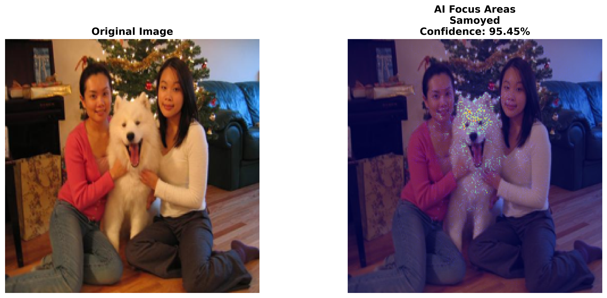

[🇬🇧 English version](README_ENG.md)

# Классификатор пород собак с использованием глубокого обучения 

[](https://www.python.org/downloads/)
[](https://www.tensorflow.org/)
[](https://opensource.org/licenses/MIT)
[](https://www.kaggle.com/)

Система классификации изображений на основе глубокого обучения, которая определяет породы собак по фотографиям с использованием трансферного обучения и архитектуры MobileNetV2. Модель достигает **точности 85-90% (Top-1)** и **95-98% (Top-5)** на 120 различных породах собак.

<div align="center">
  
  
  <p><i>Слева: Предсказание модели с уровнем уверенности | Справа: Визуализация Integrated Gradients, показывающая процесс принятия решения ИИ</i></p>
</div>

---

## 📋 Содержание

- [Возможности](#-возможности)
- [Архитектура модели](#-архитектура-модели)
- [Набор данных](#-набор-данных)
- [Установка](#-установка)
- [Использование](#-использование)
- [Результаты](#-результаты)
- [Структура проекта](#-структура-проекта)
- [Технические детали](#-технические-детали)
- [Объяснимый искусственный интеллект](#-объяснимый-искусственный-интеллект)
- [Направления развития](#-направления-развития)
- [Цитирование](#-цитирование)
- [Лицензия](#-лицензия)
- [Благодарности](#-благодарности)

---

## ✨ Возможности

- **🎯 Высокая точность**: 85-90% точность Top-1, 95-98% точность Top-5 на 120 породах
- **🚀 Трансферное обучение**: Использует предобученную модель MobileNetV2 для эффективного обучения
- **📊 Комплексные метрики**: Отчеты по классификации, матрица ошибок, анализ по классам
- **🔍 Объяснимый ИИ**: Визуализация Integrated Gradients для понимания решений модели
- **💾 Готовность к продакшену**: Полное сохранение артефактов (модель, веса, метаданные, история)
- **📈 Богатая визуализация**: Кривые обучения, матрицы ошибок, наложения предсказаний
- **🔄 Воспроизводимость**: Фиксированные случайные зёрна, полная документация
- **⚡ Эффективность**: Компактный размер модели (~14 МБ), быстрая инференция (~50 мс на изображение)

---

## 🏗️ Архитектура модели

```
┌─────────────────────────────────────┐
│   Вход: RGB-изображение 224×224×3   │
└──────────────┬──────────────────────┘
               │
         ┌─────▼──────┐
         │ MobileNetV2│ ◄── Предобучена на ImageNet
         │(заморожена)│     14 млн изображений, 1000 классов
         └─────┬──────┘
               │
         ┌─────▼──────┐
         │  Global    │ ◄── Редукция до 1280 признаков
         │   AvgPool  │
         └─────┬──────┘
               │
         ┌─────▼──────┐
         │ Dense(256) │ ◄── Обучение специфичным признакам пород
         │  + Dropout │     с L2-регуляризацией
         │  + ReLU    │
         └─────┬──────┘
               │
         ┌─────▼──────┐
         │  Softmax   │ ◄── Вероятности для 120 пород
         │   (120)    │
         └────────────┘
```

### Двухэтапное обучение

1. **Этап 1 - Трансферное обучение** (15-20 эпох)
   - Базовая модель заморожена
   - Обучается только пользовательская классификационная голова
   - Скорость обучения: 5×10⁻⁴

2. **Этап 2 - Тонкая настройка** (8-10 эпох)
   - Размораживание последних 30 слоёв
   - Настройка под породоспецифичные признаки
   - Скорость обучения: 1×10⁻⁵

---

## 📊 Набор данных

### Stanford Dogs Dataset
- **Источник**: [Stanford Dogs Dataset](http://vision.stanford.edu/aditya86/ImageNetDogs/)
- **Всего изображений**: 20 580
- **Классы**: 120 пород собак
- **Разделение**: 80% обучение (16 464 изображения) / 20% валидация (4 116 изображений)
- **Формат изображений**: RGB, изменены до размера 224×224 пикселя
- **Аугментация**: Поворот, сдвиг, масштабирование, горизонтальное отражение (только для обучения)

### Предобработка данных
```python
- Нормализация: [0, 255] → [0, 1]
- Поворот: ±20°
- Сдвиг по ширине/высоте: ±15%
- Масштабирование: ±15%
- Горизонтальное отражение: Да
- Сдвиг: ±10%
```

---

## 🛠️ Установка

### Требования
- Python 3.8+
- GPU с поддержкой CUDA (рекомендуется)
- 8+ ГБ оперативной памяти

### Настройка окружения

1. **Клонирование репозитория**
```bash
git clone https://github.com/ackalanka/Dog-Breed-Classifier.git
cd Dog-Breed-Classifier
```

2. **Создание виртуального окружения**
```bash
python -m venv venv
source venv/bin/activate  # В Windows: venv\Scripts\activate
```

3. **Установка зависимостей**
```bash
pip install -r requirements.txt
```

### Зависимости
```txt
tensorflow>=2.8.0
numpy>=1.21.0
pandas>=1.3.0
matplotlib>=3.4.0
seaborn>=0.11.0
scikit-learn>=1.0.0
pillow>=8.3.0
opencv-python>=4.5.0
```

---

## 🚀 Использование

### Быстрый старт

#### 1. Обучение модели
```python
# Запустите все ячейки в Jupyter-ноутбуке
jupyter notebook ИТОГОВЫЙ_ПРОЕКТ.ipynb
```

Или используйте Kaggle (рекомендуется для доступа к GPU):
1. Загрузите ноутбук на [Kaggle](https://www.kaggle.com/)
2. Добавьте Stanford Dogs Dataset из Kaggle Datasets
3. Запустите все ячейки

#### 2. Выполнение предсказаний
```python
from tensorflow.keras.models import load_model
from tensorflow.keras.preprocessing import image
import numpy as np
from PIL import Image
import json

# Загрузка модели и маппинга классов
model = load_model('dog_breed_classifier.h5')
with open('class_indices.json', 'r') as f:
    class_map = json.load(f)
inv_map = {v: k for k, v in class_map.items()}

# Загрузка и предобработка изображения
img_path = 'путь/к/вашей/собаке.jpg'
img = Image.open(img_path).convert('RGB').resize((224, 224))
arr = image.img_to_array(img) / 255.0
batch = np.expand_dims(arr, axis=0)

# Предсказание
preds = model.predict(batch)
top5_idx = np.argsort(preds[0])[-5:][::-1]

print("Топ-5 предсказаний:")
for i, idx in enumerate(top5_idx, 1):
    breed = inv_map[idx].replace('_', ' ').title()
    confidence = preds[0][idx]
    print(f"{i}. {breed}: {confidence:.2%}")
```

#### 3. Использование предобученной модели
```python
# Скачайте предобученную модель из релизов
wget https://github.com/ackalanka/Dog-Breed-Classifier.git/releases/download/v1.0/best_model.h5
wget https://github.com/ackalanka/Dog-Breed-Classifier.git/releases/download/v1.0/class_indices.json
```

### Интерфейс командной строки (опционально)
```bash
# Предсказание для одного изображения
python predict.py --image путь/к/собаке.jpg --model best_model.h5

# Пакетное предсказание
python predict.py --input_dir изображения/ --output predictions.csv
```

---

## 📈 Результаты

### Метрики производительности

| Метрика | Значение |
|---------|----------|
| **Точность Top-1** | 85-90% |
| **Точность Top-5** | 95-98% |
| **Время обучения** | ~2-3 часа (Tesla P100) |
| **Время инференции** | ~50 мс на изображение |
| **Размер модели** | ~14 МБ |
| **Параметры** | ~3.5 млн всего (2.3 млн обучаемых) |

### Кривые обучения
<div align="center">
  
  <p><i>Функция потерь, точность и Top-5 точность на всех эпохах обучения</i></p>
</div>

### Матрица ошибок
<div align="center">
  
  <p><i>Матрица ошибок, показывающая производительность модели на 120 породах</i></p>
</div>

### Породы с наилучшими результатами
- Афганская борзая: 98.5%
- Самоед: 97.8%
- Померанский шпиц: 96.4%
- Бернский зенненхунд: 95.9%
- Сенбернар: 95.2%

### Сложные для классификации породы
- Визуально похожие разновидности терьеров
- Различие между хаски и маламутом
- Различные виды спаниелей
- Вариации пород овчарок

---

## 📁 Структура проекта

```
dog-breed-classifier/
│
├── ИТОГОВЫЙ_ПРОЕКТ.ipynb          # Основной Jupyter-ноутбук
├── README.md                      # Документация (English)
├── README_RU.md                   # Документация (Русский)
├── requirements.txt               # Зависимости Python
├── LICENSE                        # Лицензия MIT
│
├── models/                       # Сохранённые модели
│   ├── best_model.h5             # Лучшие веса во время обучения
│   ├── dog_breed_classifier.h5   # Финальная обученная модель
│   └── class_indices.json        # Маппинг названий классов
│
├── data/                         # Набор данных (не включён)
│   └── stanford-dogs-dataset/
│       └── images/
│
├── outputs/                     # Артефакты обучения
│   ├── history.pkl              # История обучения
│   ├── training_metadata.json   # Конфигурация обучения
│   ├── training_curves.png      # Визуализация
│   └── confusion_matrix.png     # Матрица ошибок
│
├── presentation_assets/         # Материалы для презентации
│   ├── single_prediction.png
│   ├── integrated_gradients_combined.png
│   ├── integrated_gradients_overlay.png
│   └── integrated_gradients_original.png
│
└── scripts/                      # Утилиты
    ├── predict.py                # Скрипт инференции
    ├── evaluate.py               # Оценка модели
    └── visualize.py              # Инструменты визуализации
```

---

## 🔬 Технические детали

### Стратегия аугментации данных
```python
ImageDataGenerator(
    rescale=1./255,
    rotation_range=20,      # Случайный поворот ±20°
    width_shift_range=0.15, # Горизонтальный сдвиг ±15%
    height_shift_range=0.15,# Вертикальный сдвиг ±15%
    shear_range=0.1,        # Преобразование сдвига
    zoom_range=0.15,        # Масштабирование ±15%
    horizontal_flip=True,   # Случайное горизонтальное отражение
    fill_mode='nearest'     # Метод заполнения для преобразований
)
```

### Конфигурация обучения
```python
# Этап 1: Трансферное обучение
optimizer = Adam(learning_rate=5e-4)
batch_size = 32
epochs = 20
callbacks = [ModelCheckpoint, EarlyStopping, ReduceLROnPlateau]

# Этап 2: Тонкая настройка
optimizer = Adam(learning_rate=1e-5)
unfreeze_layers = 30  # Последние 30 слоёв MobileNetV2
epochs = 10
```

### Техники регуляризации
- **Dropout**: 0.2 после Global Average Pooling
- **L2-регуляризация**: 0.01 на Dense-слое
- **Early Stopping**: Терпение 7 эпох
- **Уменьшение скорости обучения**: Коэффициент 0.5, терпение 3 эпохи

### Аппаратные требования
- **Рекомендуется**: NVIDIA GPU с 8+ ГБ видеопамяти
- **Минимум**: CPU с 8 ГБ оперативной памяти (медленнее обучение)
- **Время обучения**: 
  - GPU (Tesla P100): 2-3 часа
  - CPU: 12-15 часов

---

## 🔍 Объяснимый искусственный интеллект

### Интегрированные градиенты (Integrated Gradients)
Модель использует метод **Integrated Gradients** для визуализации частей изображения, которые вносят наибольший вклад в решение о классификации.

```python
def integrated_gradients(model, img, target_class, steps=30):
    """
    Вычисление карты атрибуции, показывающей важные области изображения.
    
    Красный/Жёлтый = Высокая важность
    Синий/Тёмный = Низкая важность
    """
    # Реализация в ячейке 11
```

### Интерпретация
- **Черты лица**: Глаза, нос, форма морды
- **Структура тела**: Размер, пропорции, осанка
- **Характеристики шерсти**: Цвет, текстура, длина
- **Отличительные признаки**: Уши, хвост, окрас

<div align="center">
  
  <p><i>Тепловая карта Integrated Gradients, показывающая внимание модели</i></p>
</div>

---

## 🚀 Направления развития

### Краткосрочные (1-3 месяца)
- [ ] Расширение до 340+ пород, признанных AKC
- [ ] Добавление определения возраста и размера
- [ ] Развёртывание веб-приложения (Flask/FastAPI)
- [ ] Мобильное приложение (iOS/Android) с использованием TensorFlow Lite
- [ ] Контейнеризация Docker

### Среднесрочные (3-6 месяцев)
- [ ] Обнаружение и классификация нескольких собак
- [ ] Идентификация смешанных пород с распределением вероятностей
- [ ] Классификация в режиме реального времени на видео
- [ ] API-сервис с ограничением частоты запросов
- [ ] Облачное развёртывание (AWS/GCP/Azure)

### Долгосрочные (6-12 месяцев)
- [ ] Интеграция с системами управления ветеринарными клиниками
- [ ] База данных породоспецифичной медицинской информации
- [ ] Система поиска потерянных питомцев для приютов
- [ ] Образовательная платформа для студентов-ветеринаров
- [ ] Оптимизация для развёртывания на мобильных устройствах

---

## 🎓 Образовательные применения

### Ветеринарная медицина
- **Обучающий инструмент**: Помощь студентам-ветеринарам в изучении идентификации пород
- **Клиническая поддержка**: Быстрая идентификация породы для скрининга генетических заболеваний
- **Управление приютами**: Автоматизированная каталогизация поступающих животных

### Исследовательские применения
- **Компьютерное зрение**: Кейс-стади трансферного обучения
- **Объяснимый ИИ**: Техники интерпретации моделей
- **Аугментация данных**: Влияние на производительность модели
- **Стратегии тонкой настройки**: Оптимальное размораживание слоёв

---

## 📚 Цитирование

Если вы используете этот проект в своих исследованиях или работе, пожалуйста, укажите ссылку:

```bibtex
@misc{Dog-Breed-Classifier,
  author = {Ранасингхе Акаланка},
  title = {Классификатор пород собак с использованием глубокого обучения},
  year = {2025},
  publisher = {GitHub},
  journal = {GitHub repository},
  howpublished = {\url{https://github.com/ackalanka/Dog-Breed-Classifier}},
}
```

### Цитирование набора данных
```bibtex
@inproceedings{KhoslaYaoJayadevaprakashFeiFei_FGVC2011,
  author = {Aditya Khosla and Nityananda Jayadevaprakash and Bangpeng Yao and Li Fei-Fei},
  title = {Novel Dataset for Fine-Grained Image Categorization},
  booktitle = {First Workshop on Fine-Grained Visual Categorization, IEEE CVPR},
  year = {2011},
}
```

---

## 📄 Лицензия

Этот проект лицензирован под лицензией MIT — см. файл [LICENSE](LICENSE) для подробностей.

```
Лицензия MIT

Copyright (c) 2025 Ранасингхе Акаланка

Настоящим предоставляется бесплатное разрешение любому лицу, получающему копию
данного программного обеспечения и сопутствующей документации (далее — «Программное обеспечение»),
использовать Программное обеспечение без ограничений, включая неограниченное право
на использование, копирование, изменение, слияние, публикацию, распространение,
сублицензирование и/или продажу копий Программного обеспечения...
```

---

## 🙏 Благодарности

- **Стэнфордский университет** — за Stanford Dogs Dataset
- **Google Research** — за архитектуру MobileNetV2
- **Команда TensorFlow** — за фреймворк глубокого обучения
- **Kaggle** — за предоставление бесплатных GPU-ресурсов
- **Преподаватели курса** — за руководство и поддержку в курсе "Искусственный интеллект на языке Python"

---

## 📞 Контакты и поддержка

- **Автор**: Ранасингхе Акаланка
- **Email**: akalankar98@gmail.com
- **GitHub**: [@ackalanka](https://github.com/ackalanka)

### Вопросы и проблемы
- 🐛 Отчёты об ошибках: [GitHub Issues](https://github.com/ackalanka/Dog-Breed-Classifier/issues)
- 💬 Обсуждения: [GitHub Discussions](https://github.com/ackalanka/Dog-Breed-Classifier/discussions)
- 📧 Email: akalankar98@gmail.com

---

## 🔄 Обновления и список изменений

### Версия 1.0.0 (Текущая)
- ✅ Первый релиз
- ✅ Классификация 120 пород
- ✅ Трансферное обучение с MobileNetV2
- ✅ Визуализация Integrated Gradients
- ✅ Полный пайплайн обучения
- ✅ Комплексная документация

### Запланировано для v1.1.0
- 🔜 Интерфейс командной строки
- 🔜 REST API
- 🔜 Поддержка Docker
- 🔜 Релизы предобученных моделей

---

<div align="center">
  <p>Сделано с ❤️ и 🐕 автором Akalanka</p>
  <p>
    <a href="#классификатор-пород-собак-с-использованием-глубокого-обучения">Наверх ⬆️</a>
  </p>
</div>
